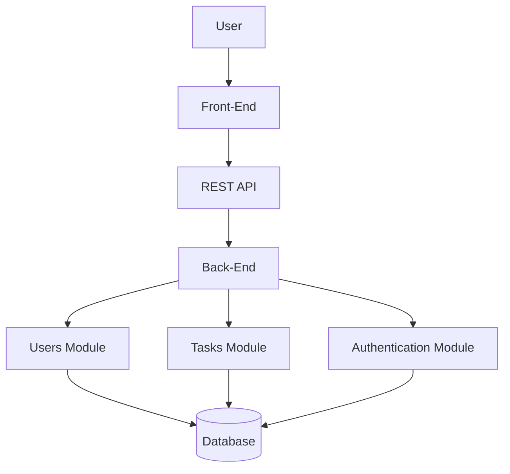

```mermaid
flowchart TD
    A[User] --> B[Front-End]
    B --> C[REST API]
    C --> D[Back-End]
    D --> E[Users Module]
    D --> F[Tasks Module]
    D --> G[Authentication Module]
    E --> H[(Database)]
    F --> H
    G --> H
```
